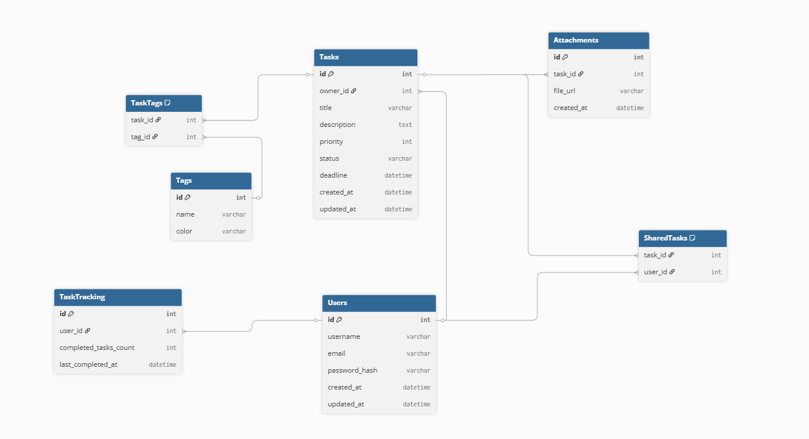

# Tasker

Tasker is a task management application that allows assigning tasks to users, tracking progress, setting priorities and deadlines, and organizing team work efficiently.

## Features

- User management and task assignment.
- Tasks have: name, description, priority, deadline, and tags.
- Ability to share tasks between users.
- Task statuses: To Do, In Progress, Done.
- Adding comments and attachments to tasks.
- Task change history tracking.
- Filtering and sorting tasks by priority, deadline, tags, and assigned users.
- Dashboard view: list, kanban board, or calendar view.
- Reports and team progress statistics.

## Architecture

The project is divided into three main layers:

- **Domain** – business logic and data models.
- **Application** – services, interfaces, and operations on tasks and users.
- **Infrastructure** – database implementation and external integrations.

## Database Schema

Here is the database schema for Tasker:



Main tables:
- `Users` – stores user information.
- `Tasks` – stores task details.
- `TaskTags` – associates tags with tasks.
- `UserTasks` – associates tasks with users (assignments and shared tasks).

## Installation & Running

1. Clone the repository:
   ```bash
   git clone https://github.com/h4rdPL/Tasker.git
